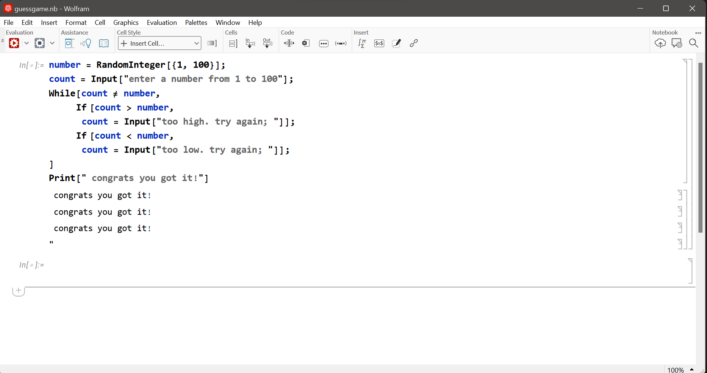
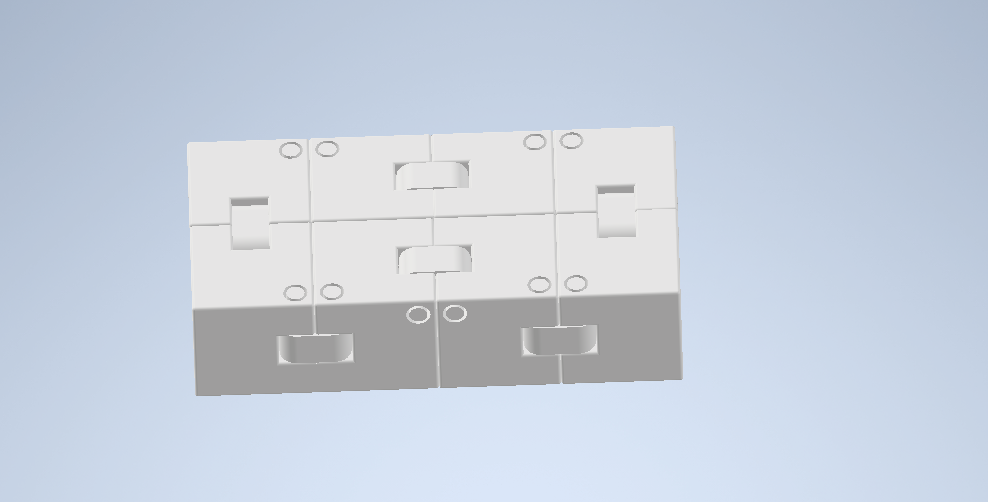
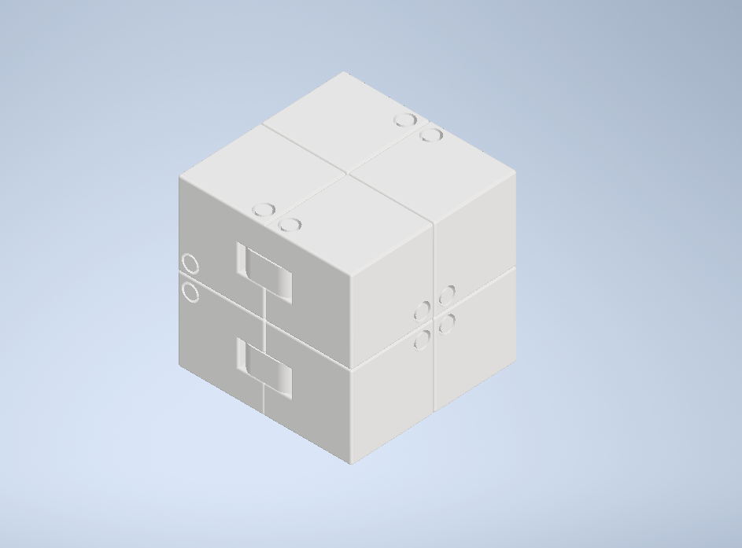

# This is Levis portfolio
this is my app, it simulates a ios virtual machine

<a href="https://www.figma.com/design/W24io6PArAJTvi9FiclvVk/Java-Machine" target=_blank>figma app</a>

# Guessing game
this game makes you guess a number from 1 to 100 and once you get it a message pops up congratulating you on getting the right number

<a href="https://youtu.be/-lioCdnisxA" target=_blank>guessing game</a>

# This is my toy infinity cube

# This is a photoshop that i made, its mrbean as the man in the famous painting gothic american

# I had technical issues with my project it was meant to be a walkthrough on how to play rainbow six siege but due to all the issues it became a funny compilation it is meant to be funny. of course this isnt what i wanted to do but this is what i made with the time i had.
<a href="https://youtu.be/tcdk4esflyk" target=_blank>personal project</a>
